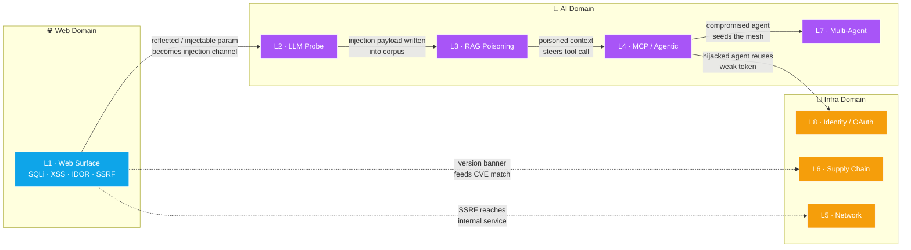
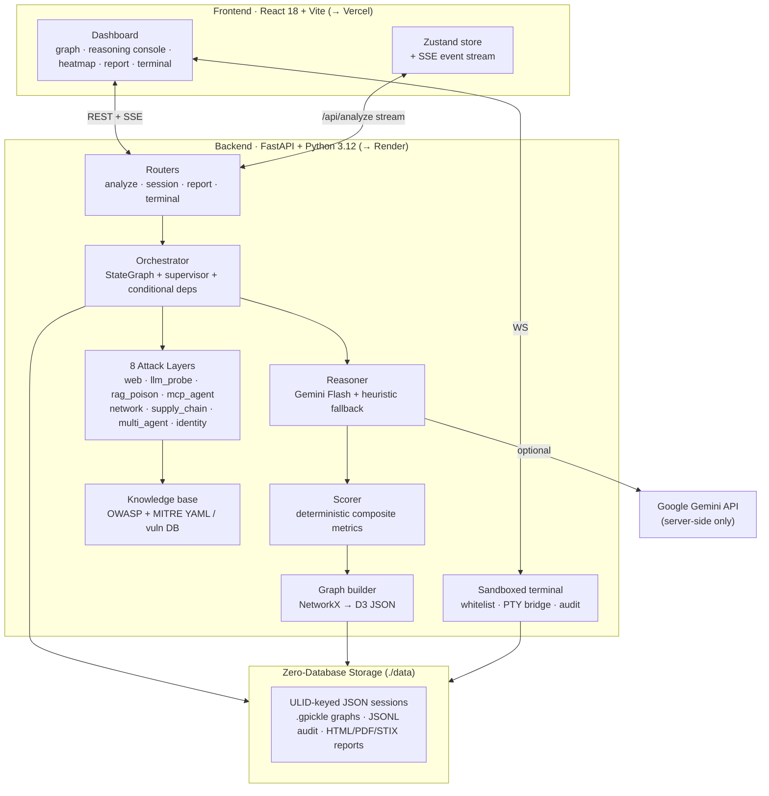
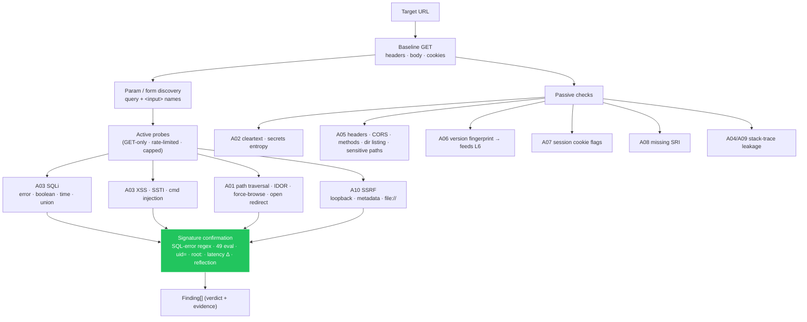
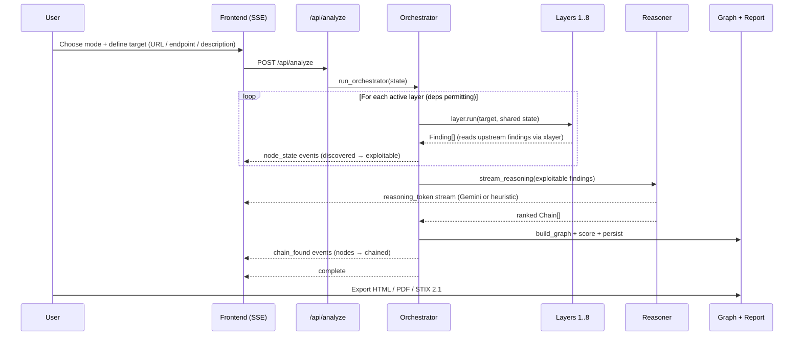
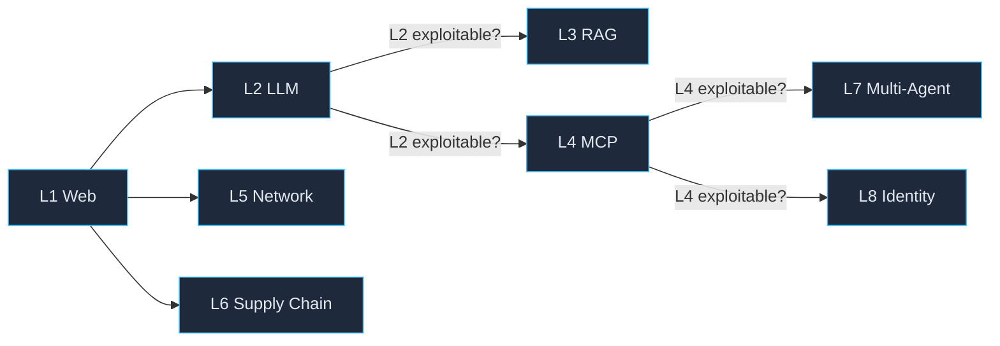
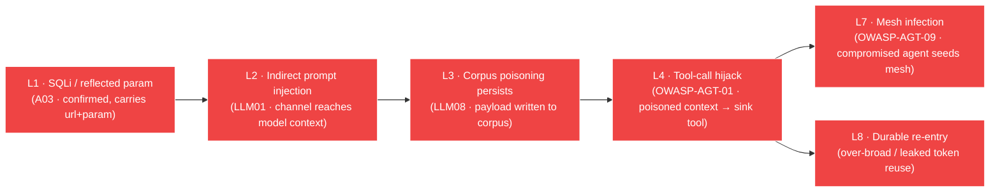
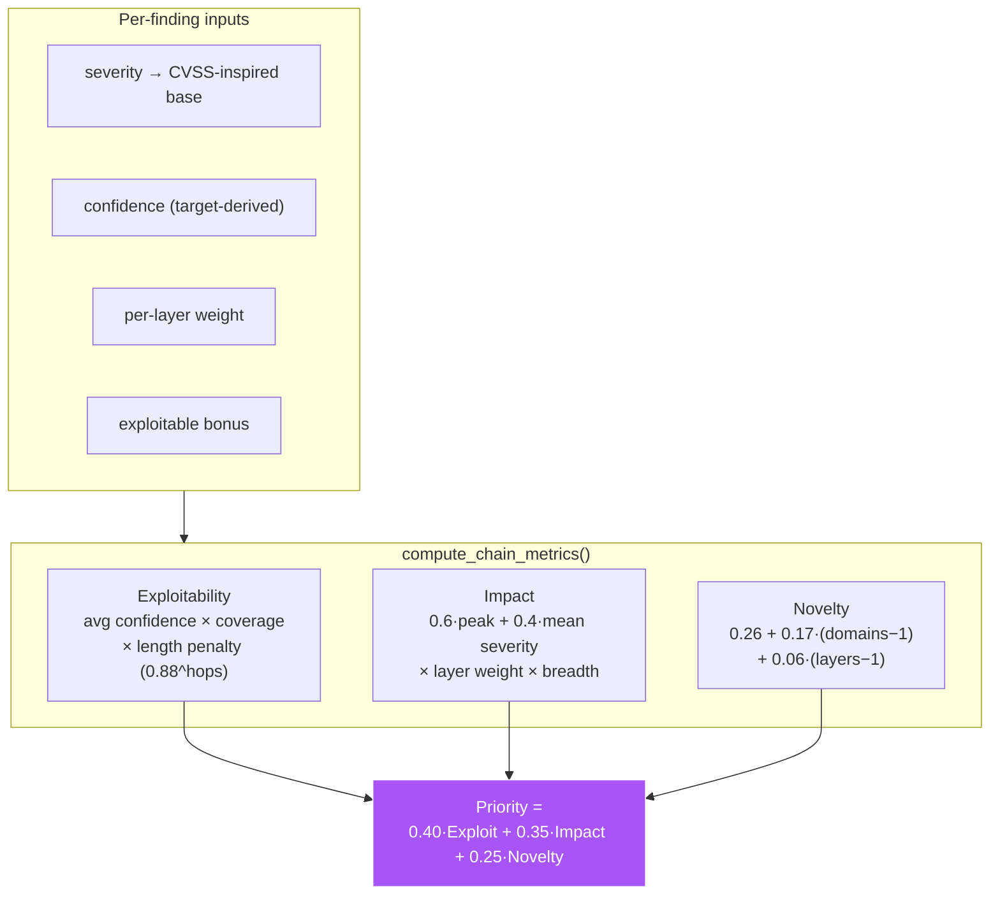
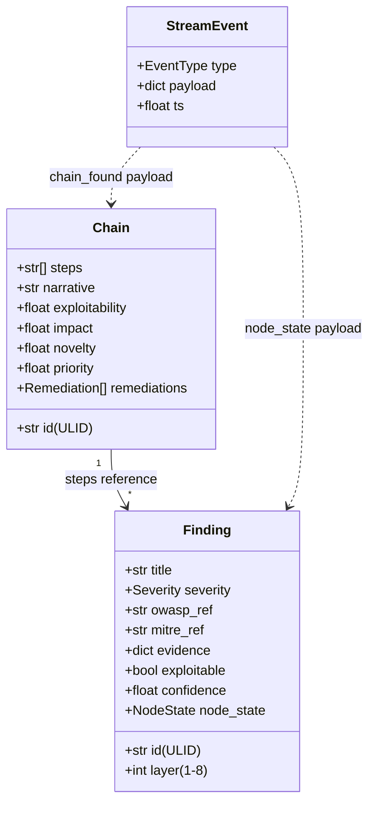
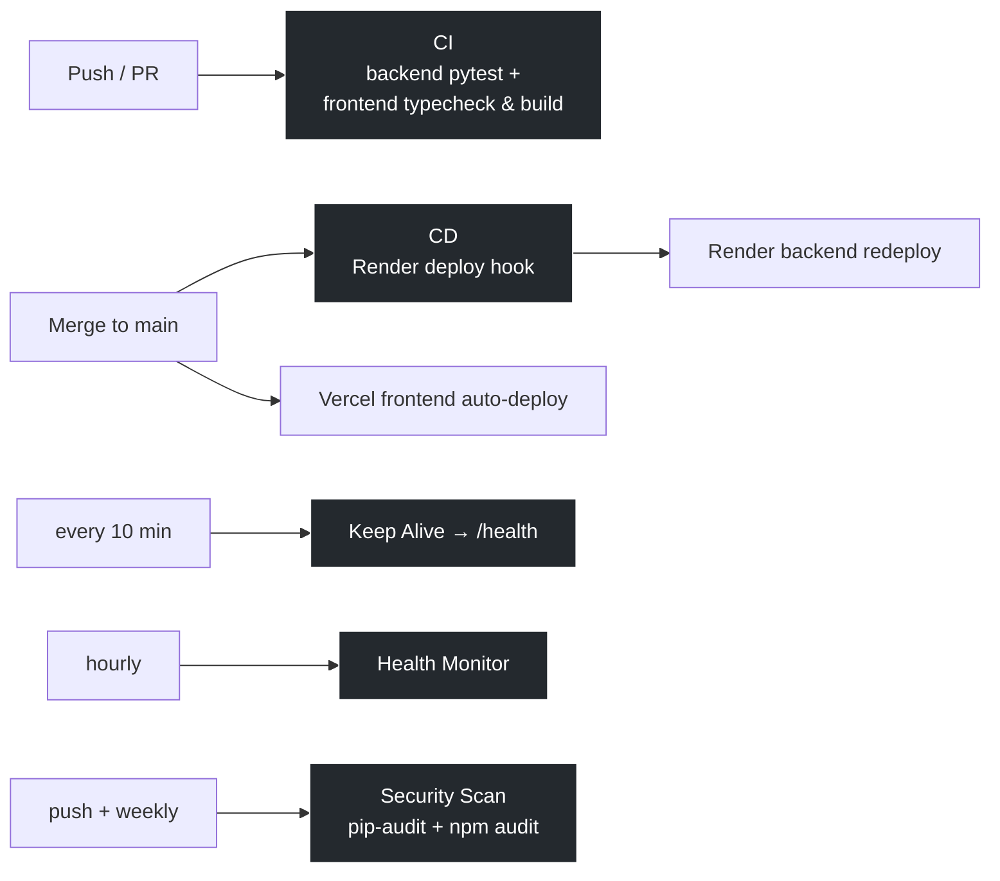

<div align="center">

# ARGUS
### Adversarial Reasoning & Graph-based Unified Security Framework

**The only red-team platform that _reasons_ about attack chains _across_ 8 security layers — modeling how a web injection feeds an LLM that poisons a RAG corpus that hijacks an agent that pivots across the network and abuses an identity boundary.**


[](https://github.com/12vethamithran/ARGUS-Adversarial-Reasoning-Graph-Unified-Security/actions/workflows/ci.yml)
[](https://github.com/12vethamithran/ARGUS-Adversarial-Reasoning-Graph-Unified-Security/actions/workflows/cd.yml)
[](https://github.com/12vethamithran/ARGUS-Adversarial-Reasoning-Graph-Unified-Security/actions/workflows/security.yml)

</div>

---

## Table of Contents

- [The Problem ARGUS Solves](#the-problem-argus-solves)
- [Core Idea: Cross-Layer Reasoning](#core-idea-cross-layer-reasoning)
- [System Architecture](#system-architecture)
- [The 8 Attack Layers](#the-8-attack-layers)
- [Layer 1 — Full OWASP Web Top 10 Engine](#layer-1--full-owasp-web-top-10-engine)
- [Analysis Workflow (End-to-End)](#analysis-workflow-end-to-end)
- [Cross-Layer Attack Chains](#cross-layer-attack-chains)
- [Reasoning & Scoring Model](#reasoning--scoring-model)
- [Data Contracts](#data-contracts)
- [Tech Stack](#tech-stack)
- [Getting Started](#getting-started)
- [API Reference](#api-reference)
- [Project Structure](#project-structure)
- [CI/CD & Operations](#cicd--operations)
- [Security & Ethics](#security--ethics)
- [Deployment](#deployment)

---

## The Problem ARGUS Solves

Modern AI systems are attacked **across domains**, but every existing tool inspects a single silo:

| Tool | Scope | Structural blind spot |
|------|-------|-----------------------|
| Burp / ZAP | Web only | Can't see the LLM, the agent's tools, or the network |
| Garak / PyRIT | LLMs only | Can't see the web entry point or the agent runtime |
| Nessus / Metasploit | Network only | Can't see the AI layer at all |

A real breach **chains these together**. A reflected parameter on the web tier becomes an indirect prompt-injection channel into an LLM; that LLM retrieves a poisoned RAG document; the poisoned context steers an MCP agent into a privileged tool call; the agent reuses an over-broad OAuth token to persist. **No siloed scanner can see that path.**

> ARGUS scans all eight layers and then **reasons** about how a finding in one layer _enables_ an attack in the next — surfacing emergent cross-layer kill-chains, then ranking them by exploitability, impact, and novelty.

---

## Core Idea: Cross-Layer Reasoning



The dashed and solid arrows above are **implemented cross-layer predicates** (`backend/app/layers/xlayer.py` + per-layer wiring), not decorative. Each downstream layer queries the shared session state for the upstream finding that enables it, so a chain is **grounded in real evidence** rather than asserted.

---

## System Architecture



**Design principles**

- **Zero database.** Everything is files: `aiofiles` atomic writes, ULID keys, a TTL janitor. A session folder zips and ships to a colleague. No ORM, no migrations.
- **Gemini optional.** With no API key, the reasoner falls back to a deterministic heuristic that still emits ranked, narrated chains — the demo always works.
- **Deterministic where it must be.** Simulated layers derive findings from a stable hash of the target (`engine/target_profile.py`), so the same target reproduces, but different targets produce genuinely different scores.

---

## The 8 Attack Layers

| # | Layer | Focus | Standard | Mode |
|---|-------|-------|----------|------|
| **L1** | Web Surface | **Full OWASP Web Top 10** — SQLi, XSS, IDOR, broken access control, SSRF, SSTI, command injection, path traversal, misconfig, crypto, integrity, logging | OWASP Web Top 10 (2021) | Basic + Advanced |
| **L2** | LLM Probe | Direct/indirect prompt injection, jailbreaks, obfuscation, system-prompt leakage, insecure output handling, tool-call exfil | OWASP LLM01/02/06/07:2025 | Basic + Advanced |
| **L3** | RAG Poisoning | Adversarial doc injection, retrieval displacement, citation spoofing, instruction embedding | OWASP LLM08:2025 | Basic + Advanced |
| **L4** | MCP / Agentic | Tool-call hijack, confused deputy, rug-pull, tool shadowing, argument injection, excessive agency | OWASP Agentic Top 10 | Advanced |
| **L5** | Network Recon | Topology, reachable services, lateral movement, exposed inference | MITRE ATT&CK T1046 / T1021 | Advanced |
| **L6** | Supply Chain | Vulnerable deps (CVE), typosquats, unvetted skills (SkillJect) | OWASP A06:2021 | Advanced |
| **L7** | Multi-Agent | Prompt-infection diffusion across an agent mesh | MASpi / Prompt Infection | Advanced |
| **L8** | Identity / OAuth | Token interception, scope abuse, missing PKCE, refresh-token replay, session fixation, JWT alg confusion | MITRE ATLAS | Advanced |

> **Basic mode** runs L1–L3 (quick assessment, light theme). **Advanced mode** runs all 8 layers + sandboxed terminal (dark war-room theme).

---

## Layer 1 — Full OWASP Web Top 10 Engine

Layer 1 is the deepest module. It maps to **every** OWASP Web Top 10 (2021) category using a **versioned payload taxonomy** (`backend/app/layers/web_payloads.py`) and active, signature-confirmed probes (`backend/app/layers/web.py`).



### Attack families & techniques (multi-payload)

| Family | OWASP | Techniques (multiple payloads each) | Confirmation signal |
|--------|-------|--------------------------------------|----------------------|
| **SQL Injection** | A03 | error-based · boolean-based · **time-based (≤5 s cap)** · union-based | DB-engine error regexes (MySQL/Postgres/MSSQL/Oracle/SQLite); response-similarity diff; latency delta |
| **XSS** | A03 | HTML-body · attribute-breakout · JS-string context | Unescaped proof-token reflection |
| **SSTI** | A03 | `{{7*7}}` · `${7*7}` · `<%=7*7%>` · `#{7*7}` | Evaluated `49` present, literal absent |
| **Command Injection** | A03 | separator · subshell · time-based | `uid=…(` output or latency delta |
| **Path Traversal / LFI** | A01 | `../` · URL-encoded · nested · Windows | `root:…:0:0:` / ini-section signature |
| **IDOR** | A01 | bounded adjacent-ID probing (±1, +2) | Structurally-similar page, different object |
| **Broken Access Control** | A01 | privileged-path force-browse | Admin/management UI content reachable unauth |
| **Open Redirect** | A01 | protocol-relative · backslash · absolute | `Location` header points to attacker host |
| **SSRF** | A10 | loopback · cloud metadata · `file://` | Internal content / metadata marker reflected |

**Safety guarantees (authorized testing only):** all active probes are **GET-only and non-destructive**, requests are rate-limited (`Semaphore(6)`), the connection pool is capped (`max_connections=8`), at most 6 params are fuzzed, time-based payloads are clamped to `MAX_TIME_BASED_DELAY = 5 s`, and IDOR probing is bounded to a few adjacent IDs and never writes. Every hit is **confirmed by a content/timing signature** so catch-all 200 pages don't cause false positives.

---

## Analysis Workflow (End-to-End)



### Conditional layer dependencies

The orchestrator (`backend/app/engine/orchestrator.py`) runs layers in order but **skips a layer when its prerequisites found nothing exploitable** — so the run mirrors a real attacker's decision tree:



`_LAYER_DEPS = {3:[2], 4:[2], 7:[4], 8:[4]}` — RAG and MCP only run if the LLM probe found a live exploitable surface; multi-agent and identity only run if MCP did.

---

## Cross-Layer Attack Chains

Each downstream layer consumes upstream evidence through shared queries in `backend/app/layers/xlayer.py` and per-layer wiring. A representative full kill-chain:



- **L1 → L2** (`web.py` evidence + `llm_probe._l1_channels`): a confirmed injectable/reflected param (now carrying both `param` and `url`) becomes a **high-confidence indirect prompt-injection channel**.
- **L2 → L3** (`rag_poison._l2_injection_vectors`): an exploitable L2 injection can be **written into the corpus**, turning a per-session injection into durable poison.
- **L3 → L4** (`mcp_agent._l3_poison_vectors`): retrieved poisoned context **steers the agent into a write/exec sink tool**.
- **L4 → L7** (`multi_agent` + `_l4_agent_compromise`): a confirmed hijacked agent **seeds prompt-infection** across the mesh.
- **L4 → L8** (`identity` + `_l4_agent_compromise`): the hijacked agent **reuses a weak identity boundary** for persistence.

The reasoner then orders these into a kill-chain (initial access → execution → impact), and the graph builder (`engine/graph_builder.py`) renders nodes + chain edges as D3 force-directed JSON.

---

## Reasoning & Scoring Model

**Reasoner** (`backend/app/engine/reasoner.py`) — asks Gemini Flash to think like an attacker and emit 1–3 ranked cross-layer chains as strict JSON; on no-key/parse-failure it falls back to a **heuristic builder** that constructs a primary cross-layer chain (best exploitable finding per layer) plus a deeper single-domain chain, with attacker-style narratives.

**Scorer** (`backend/app/engine/scorer.py`) — the single source of truth so Gemini and heuristic paths rank on the same scale:



- **Exploitability** is penalised geometrically by chain length — every hop can fail.
- **Impact** blends peak and mean severity (a chain critical end-to-end beats one critical surrounded by noise).
- **Novelty** rewards crossing security domains (web → AI → infra) — exactly the emergent paths siloed tools miss.

---

## Data Contracts

Three Pydantic models (mirrored as TypeScript types) are the stable contract between layers, reasoner, and frontend.



`StreamEvent.type ∈ { node_state, reasoning_token, chain_found, layer_done, error, complete }`.

---

## Tech Stack

**Backend** — Python 3.12 · FastAPI · Pydantic v2 · SSE streaming · Google Gemini (optional) · WebSocket PTY terminal bridge · NetworkX · httpx · zero-database (ULID-keyed JSON files).
**Frontend** — React 18 · Vite · TypeScript · Tailwind (CSS-variable theming) · Framer Motion · D3 · xterm.js · Zustand · lucide-react.

---

## Getting Started

### Option A — Docker Compose (both services)
```bash
cp backend/.env.example backend/.env     # add GEMINI_API_KEY (optional)
docker-compose up
```

### Option B — Manual

**Backend**
```bash
cd backend
pip install -e ".[dev]"
cp .env.example .env                      # add GEMINI_API_KEY (optional)
python -m uvicorn app.main:app --reload   # http://localhost:8000
pytest -q                                 # run the test suite
```

**Frontend**
```bash
cd frontend
npm install
cp .env.example .env
npm run dev                               # http://localhost:5173
```

| Service | URL |
|---------|-----|
| Frontend | http://localhost:5173 |
| Backend API | http://localhost:8000 |
| API docs (Swagger) | http://localhost:8000/docs |

> **No Gemini key?** ARGUS still works — the reasoning engine falls back to a deterministic heuristic and produces ranked chains.

### Sandboxed recon terminal (Advanced mode)
Whitelisted, read-only recon only — exploit/destructive flags blocked, with rate limiting and idle timeout.

```
curl -I https://target            # security headers / CORS
dig target.com                    # DNS (auto nslookup on Windows)
whois target.com                  # registrar / ownership
nmap -sV -Pn --open target        # safe service scan
openssl s_client -connect t:443   # TLS chain
whatweb -a 1 https://target       # tech fingerprint
help · clear                      # built-ins
```
Allowed binaries: `nmap · curl · dig · whois · traceroute · host · openssl · nikto · whatweb · ping · netstat`.

---

## API Reference

| Method | Endpoint | Description |
|--------|----------|-------------|
| `POST` | `/api/analyze` | Start an analysis; streams `StreamEvent`s over SSE |
| `GET` | `/api/sessions` · `/api/sessions/{id}` | List / fetch sessions |
| `POST` | `/api/reports/{id}/generate` | Generate report artifacts |
| `GET` | `/api/reports/{id}/{html\|pdf\|stix}` | Download a report |
| `WS` | `/ws/terminal/{id}` | Sandboxed terminal session |
| `GET` | `/health` | Liveness check |

---

## Project Structure

```
ARGUS/
├── backend/
│   ├── app/
│   │   ├── engine/      orchestrator · reasoner · scorer · graph_builder · state · target_profile
│   │   ├── layers/      base · xlayer (cross-layer queries)
│   │   │                web + web_payloads   (L1 · OWASP Web Top 10 taxonomy)
│   │   │                llm_probe · rag_poison · mcp_agent · network
│   │   │                supply_chain · multi_agent · identity   (L2–L8)
│   │   ├── terminal/    whitelist · PTY/subprocess bridge · audit log
│   │   ├── routers/     analyze · session · report · terminal
│   │   ├── kb/          OWASP + MITRE YAML · vuln_db · manifest parser
│   │   ├── models/      Finding · Chain · StreamEvent · Session
│   │   └── main.py      FastAPI app + CORS + /health
│   └── tests/           per-layer units · web_payloads · taxonomy · chain-matching · integration
├── frontend/
│   └── src/
│       ├── pages/       Landing · Onboarding · Dashboard · TerminalView
│       ├── components/  graph · reasoning · heatmap · report · timeline · terminal · shell
│       ├── lib/         api · types · findingKb (OWASP/MITRE knowledge base) · view
│       └── store/       Zustand session store + SSE event stream
└── docker-compose.yml
```

---

## CI/CD & Operations



| Workflow | Trigger | What it does |
|----------|---------|--------------|
| **CI** | every push / PR | Backend `pytest` + frontend typecheck & Vite build |
| **CD** | push to `main` | Triggers Render redeploy via deploy hook |
| **Keep Alive** | every 10 min | Pings `/health` to prevent Render cold starts |
| **Health Monitor** | hourly | Checks backend `/health` + frontend URL |
| **Security Scan** | push to `main` + weekly | `pip-audit` (Python) + `npm audit` (Node) |

---

## Security & Ethics

ARGUS is built for **authorized security testing only**. Reason about and test **only systems you own or have explicit written permission to assess**. Layer 1's active probes send real (but non-destructive, GET-only, rate-limited, time-capped) payloads; the terminal is restricted to a non-destructive recon whitelist with exploit flags blocked. **You are responsible for staying within authorization.** Secrets (`.env`) and runtime data (`data/`) are git-ignored and must never be committed.

---

## Deployment

| Service | Platform | Notes |
|---------|----------|-------|
| Backend API | [Render](https://render.com) | Docker, persistent `/data` disk, Starter plan (WebSocket), health check `/health` |
| Frontend | [Vercel](https://vercel.com) | Static SPA, auto-deploys on push to `main` |

**Render env:** `GEMINI_API_KEY`, `ALLOWED_ORIGINS` (Vercel URL), `DATA_DIR=/data`, `SESSION_TTL_HOURS`, `LOG_LEVEL`.
**Vercel env:** `VITE_API_URL` (`https://…onrender.com`), `VITE_WS_URL` (`wss://…onrender.com`).

**Required GitHub secrets:** `RENDER_BACKEND_URL`, `RENDER_DEPLOY_HOOK_URL`, `VERCEL_FRONTEND_URL`, `GEMINI_API_KEY`.

---

## License

[MIT](./LICENSE) © 2026 Vethamithran
